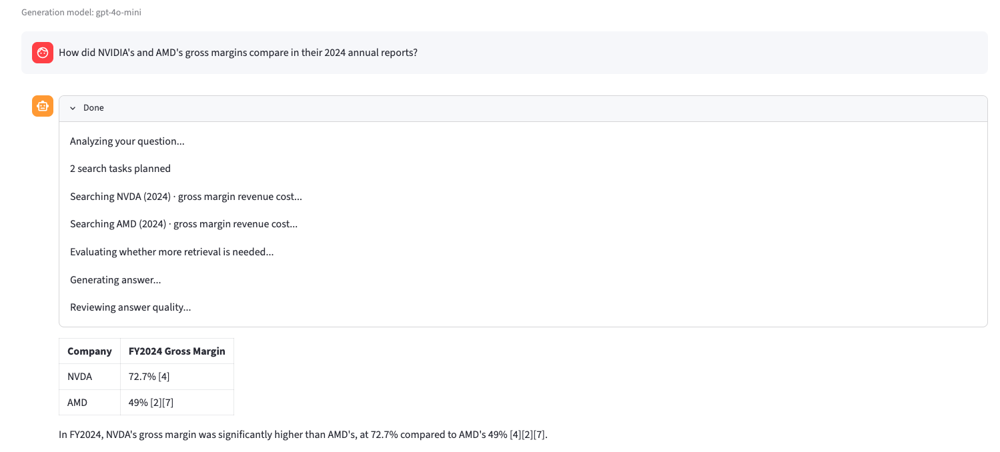
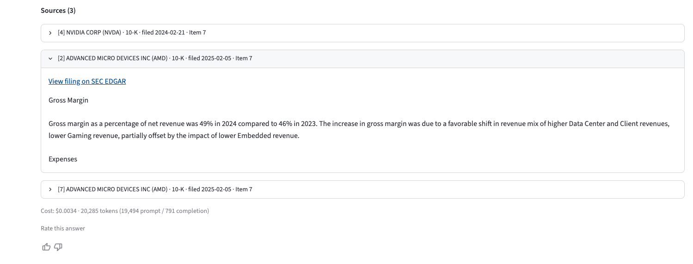
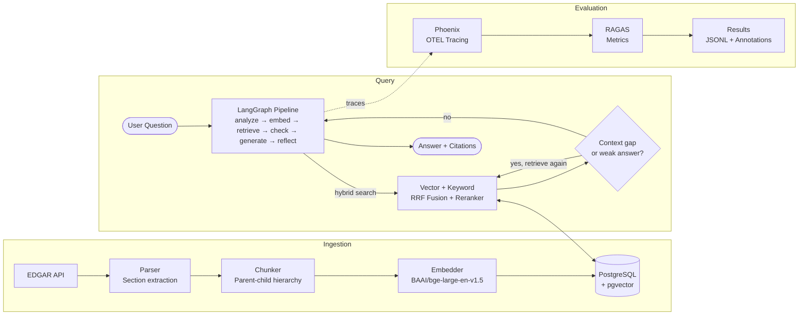
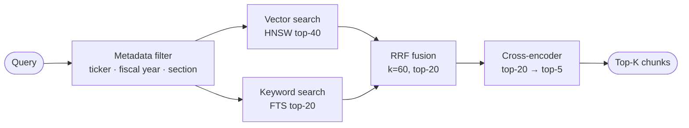
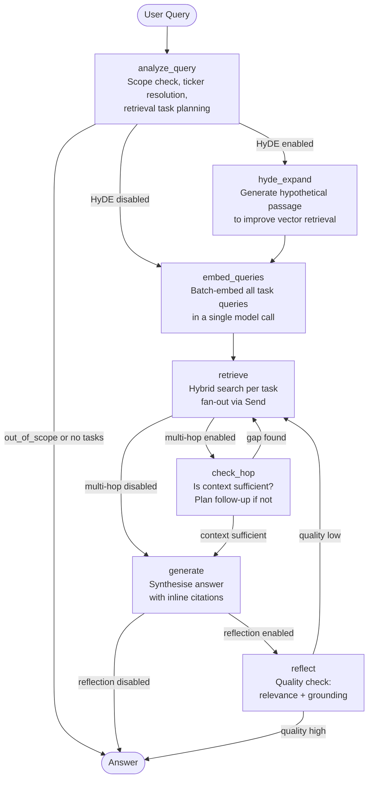

<div align="center">

# Tenk Insight

[](https://github.com/ggoyal22/tenk-insight/actions/workflows/tests.yml)
[](https://huggingface.co/spaces/gaurav-goyal/tenk-insight)

</div>

An agentic retrieval-augmented generation (RAG) system for querying SEC 10-K filings using natural language. Ask questions about publicly filed annual reports and get answers grounded in the source documents, with inline citations back to the filing. A LangGraph pipeline plans each query into sub-tasks, retrieves iteratively, and can self-reflect on answer quality.

The deployed corpus indexes **13 10-K filings from 8 companies (FY2024–2025)**: **~1.5M tokens** (≈1.1M words, roughly 3,000 pages of dense financial text) embedded as ~10,500 searchable chunks.

This is how I build reliable, production-ready agentic RAG systems. The [case study](docs/case-study.md) covers the problem it solves and the approach behind it.

## Table of Contents

1. [Demo](#demo)
2. [Architecture Overview](#architecture-overview)
3. [Key Design Choices](#key-design-choices)
4. [Examples](#examples)
5. [Stack](#stack)
6. [Ingestion](#ingestion)
7. [Retrieval](#retrieval)
8. [Generation](#generation)
9. [Evaluation](#evaluation)
10. [User Feedback](#user-feedback)
11. [Configuration Reference](#configuration-reference)
12. [Prerequisites](#prerequisites)
13. [Quickstart](#quickstart)
14. [Testing](#testing)
15. [Project Structure](#project-structure)
16. [Limitations](#limitations)
17. [License](#license)

---

## Demo

▶️ **[Live demo](https://huggingface.co/spaces/gaurav-goyal/tenk-insight)**





*Demo shown with multi-hop and self-reflection enabled.*

*The hosted Space runs on about 2 shared vCPUs with no GPU, so embedding and reranking are slower there than on a local or GPU-backed run, and response times vary with whatever else is running on the box.*

---

## Architecture Overview



---

## Key Design Choices

**Grounded by construction** — Every figure is traced back to a specific retrieved passage before it appears in an answer, and numbers are reported exactly as the filing states them, without arithmetic or derived values. When a question falls outside the loaded filings, the system says so instead of guessing from memory.

**Observable and evaluated** — Retrieval and answer quality are scored against a labelled question set with RAGAS, and every run is traced end to end in Phoenix, capturing latency, token cost, and the exact passages used. Users can rate any answer in the app, and that feedback is stored to guide later tuning.

**Plans before it searches** — Instead of sending your question straight to the search index, the system first works out what you're really asking. It resolves which company and year you mean, handles follow-ups like "how about AMD?" from the conversation, and splits a multi-part question into separate searches. A vague or out-of-scope question is caught here, so it never turns into a confident wrong answer.

**Retrieves until it has enough** — After the first search, the system asks whether what it retrieved actually answers the question. If there's a gap, it runs a focused follow-up search before writing anything, so answers aren't built on a thin first pass. The follow-up loop is capped so it always finishes.

**Precision-tuned retrieval** — Small child chunks are searched but larger parent chunks are handed to the model, so retrieval stays precise without starving the answer of context. Semantic and keyword results are combined with Reciprocal Rank Fusion and re-ranked by a cross-encoder, so the strongest evidence rises to the top. The [Retrieval](#retrieval) section has the mechanics.

**Config-driven, nothing hardcoded** — Every tunable decision, from the embedding model and chunk sizes to which agentic features run, lives in `config/config.yaml`. Optional stages like HyDE, multi-hop, and reflection are flags, so behaviour changes without touching code.

→ Deeper reading:
- **[Engineering decisions & tradeoffs](docs/design-decisions.md)**
- **[Case study](docs/case-study.md)**

---

## Examples

Real queries and the answers the system returns, with inline `[N]` citations. Each citation expands to show the passage it came from, with a link to the filing on SEC EDGAR. The source text below is excerpted, so follow the links for full context.

### Single-company query

> **Q:** What does Boeing disclose about delays and financial losses on the 777X program?

Boeing disclosed significant delays and financial losses on the 777X program: reach-forward losses of **$4.9 billion in 2025** (a $4,899 million charge recognized in Q3 2025) and **$3.5 billion in 2024**, driven by production challenges and certification and delivery delays. First delivery of the 777-9 is now expected in **2027**, with the 777-8 expected later. [1][2]

**Sources:** [1] [BA FY2025 10-K — Item 1A (Risk Factors)](https://www.sec.gov/Archives/edgar/data/12927/000162828026004357/ba-20251231.htm#:~:text=reach-forward%20losses%20of%20%244.9%20billion%20and%20%243.5%20billion) · [2] [Item 7 (MD&A)](https://www.sec.gov/Archives/edgar/data/12927/000162828026004357/ba-20251231.htm#:~:text=incremental%20reach-forward%20loss%20of%20%244%2C899%20million)

<details>
<summary>Source text (excerpt)</summary>

> **[1] Item 1A — Risk Factors:** The 777X program, which launched in 2013 and is currently expecting first delivery in 2027, recognized additional reach-forward losses of $4.9 billion and $3.5 billion in 2025 and 2024, primarily due to production challenges, certification and delivery delays, and higher estimated labor and supplier costs.
>
> **[2] Item 7 — MD&A:** In the third quarter of 2025, we … delayed first delivery of the 777-9 to 2027 … resulting in an incremental reach-forward loss of $4,899 million during 2025.

</details>

### Comparison query

> **Q:** How did NVIDIA's and AMD's gross margins compare in their 2024 annual reports?

| Company | FY2024 gross margin |
|---|---|
| NVIDIA | 72.7% [1] |
| AMD | 49% [2] |

In fiscal 2024, NVIDIA's gross margin was significantly higher than AMD's: 72.7% versus 49%. [1][2]

**Sources:** [1] [NVIDIA FY2024 10-K — Item 7 (MD&A)](https://www.sec.gov/Archives/edgar/data/1045810/000104581024000029/nvda-20240128.htm#:~:text=Our%20overall%20gross%20margin%20increased%20to%2072.7%25) · [2] [AMD FY2024 10-K — Item 7 (MD&A)](https://www.sec.gov/Archives/edgar/data/2488/000000248825000012/amd-20241228.htm#:~:text=Gross%20margin%20as%20a%20percentage%20of%20net%20revenue%20was%2049%25)

<details>
<summary>Source text (excerpt)</summary>

> **[1] NVIDIA — Item 7 (MD&A):** Our overall gross margin increased to 72.7% in fiscal year 2024 from 56.9% in fiscal year 2023. The year over year increase was primarily due to strong Data Center revenue growth of 217% and lower net inventory provisions as a percentage of revenue.
>
> **[2] AMD — Item 7 (MD&A):** Gross margin as a percentage of net revenue was 49% in 2024 compared to 46% in 2023. The increase in gross margin was due to a favorable shift in revenue mix of higher Data Center and Client revenues, lower Gaming revenue, partially offset by the impact of lower Embedded revenue.

</details>

---

## Stack

| Layer | Technology |
|---|---|
| Database | PostgreSQL + pgvector |
| Embeddings | `BAAI/bge-large-en-v1.5` (1024-dim) |
| Vector index | HNSW via pgvector |
| Keyword search | PostgreSQL FTS |
| Fusion | Reciprocal Rank Fusion (RRF) |
| Reranking | `cross-encoder/ms-marco-MiniLM-L-6-v2` |
| Generation | LangGraph + OpenAI or Ollama |
| Tracing | OpenTelemetry → Arize Phoenix or Arize Cloud |
| Evaluation | RAGAS |
| UI | Streamlit |

---

## Ingestion

The ingestion pipeline runs as a single command and processes every (ticker, form type, year) combination defined in `config/config.yaml`.

**Step 1 — Download.** Filings are fetched from the SEC EDGAR API. The `EDGAR_USER_AGENT` environment variable is required by SEC fair-use policy and must include a project name and contact email.

**Step 2 — Parse.** Raw HTML filings are parsed into named sections (Item 1, Item 1A, Item 7, etc.). Section boundaries are detected from the filing structure and used as metadata for later filtering.

**Step 3 — Chunk.** Each section is split into a two-tier hierarchy:
- **Child chunks** (256 tokens, 32-token overlap) — the unit retrieved by vector and keyword search.
- **Parent chunks** (1024 tokens, 64-token overlap) — the unit delivered to the LLM as context. Each child is linked to its parent, so retrieval is precise but the LLM always sees sufficient surrounding context.

Both tiers are split recursively on paragraph breaks (`\n\n`), then line breaks, then spaces; raw token boundaries are used only as a last resort. This preserves semantic coherence: text is only split at a finer boundary when it cannot fit at the coarser one.

**Step 4 — Embed.** Child chunks are embedded in batches using `BAAI/bge-large-en-v1.5`. The embedding model and batch size are configurable.

**Step 5 — Load.** Filings, parent chunks, and child chunks (with embeddings) are written to PostgreSQL. The vector index is built on `pgvector` using HNSW with halfvec quantization for memory and search time efficiency.

```bash
python ingest.py
```

To add more tickers or years, update `edgar.tickers` and `edgar.years` in `config/config.yaml` and re-run. The pipeline skips filings already present in the database.

---

## Retrieval

Every retrieval call runs three stages in sequence: dual search, RRF fusion, and cross-encoder reranking.



### Metadata filtering

Before searching, the query is filtered by filing metadata (ticker, fiscal year, 10-K section). The `analyze_query` generation node extracts these filters automatically from the user's question.

A section filter can be too narrow: companies vary in which 10-K item holds a given figure (financial-statement detail sometimes sits under Item 15/16 rather than Item 8). When a section-filtered search returns nothing, or its best result scores below a relevance floor, retrieval automatically re-runs without the section filter (keeping ticker and fiscal year) and merges both result sets, letting the reranker arbitrate. This widening can only add candidates, never drop a strong section-filtered hit. It is controlled by `retrieval.section_retry` and requires reranking.

### Vector search

Child chunk embeddings are indexed in an HNSW graph. The semantic query (or HyDE passage) is embedded with the same model and the top-40 nearest neighbours are fetched using cosine similarity. Halfvec quantization keeps the index compact; candidates are rescored in float32 before fusion.

### Keyword search

The task's keyword query runs against a PostgreSQL FTS index using `web` query mode, which supports `AND`/`OR` operators and prefix matching. The top-20 keyword results are collected. If the full query matches nothing, the search retries with the first three terms to avoid empty results on long or analytical queries.

### RRF fusion

Vector and keyword ranked lists are merged with Reciprocal Rank Fusion (RRF, k=60). RRF rewards documents that rank highly in both lists without requiring score normalisation across the two retrieval methods.

### Cross-encoder reranking

The top-20 fused candidates are re-scored by a cross-encoder (`ms-marco-MiniLM-L-6-v2`) against the semantic query. This is the most accurate ranking signal but requires a forward pass per candidate, so it runs only over the fused shortlist. The final 5 results are returned to the LLM.

Reranking can be disabled in config (e.g. for latency-sensitive or local deployments); `final_top_k` controls the output size in that case.

---

## Generation

The generation pipeline is a compiled [LangGraph](https://github.com/langchain-ai/langgraph) graph. Each node is a focused LLM call with a structured output schema. Three features are independently togglable: HyDE expansion, multi-hop retrieval, and self-reflection.



### Nodes

**`analyze_query`** — Classifies the query as `single`, `comparison`, or `out_of_scope`. Resolves company names to tickers, extracts the fiscal year, decomposes the query into retrieval sub-tasks (one per concept), and assigns metadata filters (ticker, fiscal year, 10-K section) to each task. For each task it also writes two purpose-built queries: a keyword query of AND-matched full-text terms, and a natural-language semantic query used for vector search and reranking. Any query that decomposes into multiple sub-tasks (a comparison across companies or years, or a single company with several distinct concepts) fans out into parallel retrieval tasks.

**`hyde_expand`** *(optional)* — Generates a hypothetical 10-K passage that would answer the query. This passage is embedded and used for vector search instead of the raw query, improving retrieval for abstract or analytical questions.

**`embed_queries`** — Batch-embeds all pending retrieval task queries in a single model call. Uses each task's HyDE passage if one was generated, otherwise falls back to the semantic query. Consolidating all embedding calls into one batch avoids the overhead of N sequential requests whenever a query fans out into multiple sub-tasks, whether a comparison across companies or years or a single company with several distinct concepts.

**`retrieve`** — Runs the full retrieval pipeline for a single task: hybrid search, RRF fusion, and cross-encoder reranking. Multiple tasks run in parallel via LangGraph's `Send` fan-out. Accumulates the retrieved parent chunks in the graph state.

**`check_hop`** *(optional)* — Evaluates whether the accumulated context is sufficient to answer the question. For each concrete gap it finds, it plans a follow-up retrieval task with a reformulated query; these fan out in parallel like the initial tasks and skip chunks already retrieved. Falls back to generation once context is sufficient or the hop limit is reached.

**`generate`** — Synthesises a final answer from the retrieved context. Produces inline citations (`[N]`) referencing the source chunks. Picks one of two prompt variants by query type: a single-answer prompt for one-company, one-year questions, and a comparison prompt for queries that span two or more companies or fiscal years.

**`reflect`** *(optional)* — Reviews the generated answer for relevance and grounding. If quality is `low`, it identifies the gap and triggers additional retrieval. Bypasses `check_hop` on its re-retrieval pass to avoid double-looping.

Every reasoning node (`analyze_query`, `check_hop`, `generate`, `reflect`) fills a structured `reasoning` field with fixed, ordered steps before emitting its output. This is not free-form "think step by step". Several of those steps act as a grounding guardrail. One, for instance, verifies that each figure's entity scope matches the query, so a company-wide number is never reported as a segment's. Another maps every figure to a specific numbered excerpt before it can appear in the answer, so nothing is asserted that does not trace back to a retrieved passage. See [design decision #12](docs/design-decisions.md#12-small-model-kept-honest-by-structured-reasoning).

---

## Evaluation

The evaluation pipeline measures answer and retrieval quality against traces captured during inference.

### Results

Measured on a set of Q&A pairs (`datasets/`) based on the source filings. Metrics computed with RAGAS.

**Generation config for this run:** HyDE off, multi-hop capped at 1 hop, reflection off.

| Query type | N | Faithfulness | Context precision | Context recall | Answer correctness |
|---|---|---|---|---|---|
| Single | 28 | 0.90 | 0.73 | 0.97 | 0.85 |
| Comparison | 25 | 0.85 | 0.62 | 0.94 | 0.70 |

Out-of-scope: 16 of 17 correctly refused (one in-scope query was over-refused).

See [a fuller reading of these metrics](docs/design-decisions.md#evaluation-results).

**Notes**

- The Q&A set is generated by an LLM from the filings and is only partially reviewed. The reference answers drive the correctness and recall scores, so any mistakes in them flow straight into the numbers.
- Both the answering model and the RAGAS judge are `gpt-4o-mini`, chosen to keep cost low. A small model grading its own family is a weaker check than a larger independent judge.
- RAGAS grades an answer by splitting it into small factual claims and checking each against the context with an LLM. That splitting doesn't hold up well on financial figures. A unit or rounding difference like $4.9B versus $4,899M can look like a mismatch, so faithfulness and correctness are noisier on number-heavy answers than on plain text.

Fixing the evaluation setup is the first item in [what's next](docs/design-decisions.md#whats-next), since every other improvement gets judged by these numbers.

### Tracing

Every inference run emits OpenTelemetry spans to [Arize Phoenix](https://github.com/Arize-ai/phoenix), nested under a single trace per query. Spans capture the full pipeline state: query, retrieved chunks, generated answer, token usage, and per-node latency. Within that trace, each LLM call sits under the node that issued it with the structured reasoning behind its output, and each retrieval stage (vector search, keyword search, fusion, reranking) records its own ranked chunk IDs and scores, so a chunk can be followed from first retrieval to final ranking. Setting `PHOENIX_API_KEY` and `ARIZE_SPACE_ID` sends the same spans to Arize Cloud instead.

### Running an evaluation

```bash
python scripts/evaluate.py                  # run the pipeline over the golden set, then score
python scripts/evaluate.py --eval-only      # score traces already in Phoenix
python scripts/evaluate.py --no-eval        # generate and print a Q&A table; skip scoring
python scripts/evaluate.py --print-answers  # generate, print the Q&A table, then score
python scripts/evaluate.py --difficulty easy  # restrict to golden queries of one difficulty
```

By default, `evaluate.py` runs the generation pipeline over the golden queries (capturing a trace per query in Phoenix), then scores those traces with RAGAS. Pass `--eval-only` to skip generation and score traces already in Phoenix instead. `--no-eval` runs generation and prints a Q&A table without scoring (useful for eyeballing answers), `--print-answers` does the same but continues to scoring, and `--difficulty` limits the run to golden queries tagged `easy`, `medium`, or `hard`. Either way, golden reference answers are attached for the metrics that need them. Results are printed to stdout and appended to `data/eval_results/runs.jsonl`, and per-trace scores are written back to Phoenix as span annotations.

### Metrics

| Metric | What it measures | Requires golden |
|---|---|---|
| `faithfulness` | Are all claims in the answer grounded in the retrieved context? | No |
| `answer_correctness` | Does the answer match the reference answer? | Yes |
| `context_precision` | Are relevant chunks ranked higher than irrelevant ones in the retrieved context? | No |
| `context_recall` | Does the retrieved context cover the reference answer? | Yes |

Metrics that require a golden answer are skipped automatically when no `golden_path` is set in config.

### Golden datasets

Reference answers live in `datasets/` as YAML files. Each entry contains a query and an expected answer. Set `evaluation.golden_path` in config to point at the relevant file for a given evaluation run.

---

## User Feedback

Every answer in the UI includes a thumbs up / thumbs down rating and an optional free-text comment. Feedback is stored in the `query_feedback` PostgreSQL table alongside the original query and the generated answer.

This dataset is intended as a future signal for pipeline improvement: low-rated answers can be inspected to identify systematic retrieval or generation failures, and high-quality query-answer pairs can seed fine-tuning or few-shot examples.

---

## Configuration Reference

All tunable parameters are in `config/config.yaml`. Environment-specific secrets (credentials, API keys) belong in `.env`.

| Section | Key parameters |
|---|---|
| `edgar` | `tickers`, `form_types`, `years` — what to ingest |
| `embedding` | `model`, `dimension`, `batch_size`, `device` |
| `chunking` | `child_chunk_size`, `child_chunk_overlap`, `parent_chunk_size`, `parent_chunk_overlap` |
| `vector_index` | `type`, `distance_function`, `hnsw_m`, `hnsw_ef_construction` |
| `retrieval` | `vector_search`, `keyword_search`, `fusion`, `reranking`, `metadata_filtering` |
| `llm` | `provider`, `model`, `temperature`, `max_tokens` |
| `generation` | `hyde.enabled`, `hop.enabled`, `hop.max_hops`, `reflection.enabled`, `reflection.max_iterations` |
| `evaluation` | `metrics`, `datasets`, `golden_path`, `results` |
| `tracing` | `enabled` |

---

## Prerequisites

- Python 3.11+
- PostgreSQL 15+ with the [pgvector](https://github.com/pgvector/pgvector) extension
- An OpenAI API key, or a local [Ollama](https://ollama.ai) instance
- An [SEC EDGAR user agent](https://www.sec.gov/os/accessing-edgar-data) string (`project-name contact@example.com`)
- [Arize Phoenix](https://github.com/Arize-ai/phoenix) (optional, required only for tracing and evaluation, with Arize Cloud supported as an export target)

---

## Quickstart

```bash
# 1. Clone and enter the project
git clone https://github.com/ggoyal22/tenk-insight.git
cd tenk-insight

# 2. Create a virtual environment and install dependencies
python -m venv .venv
source .venv/bin/activate
pip install -r requirements.txt

# 3. Configure environment
cp .env.example .env
# Edit .env: set DB credentials, LLM API key, EDGAR user agent

# 4. Edit config/config.yaml
# Set edgar.tickers, edgar.form_types, and edgar.years for what you want to ingest

# 5. Set up the database schema
python db/setup.py

# 6. Ingest filings
python ingest.py

# 7a. Launch the Streamlit UI
streamlit run app.py

# 7b. Or query from the CLI (supports multi-turn conversation)
python scripts/query.py
```

---

## Testing

```bash
pip install -r requirements-dev.txt   # test and lint tooling (pytest, etc.)
pytest
```

Unit tests need no external services. Integration tests (DB client, repositories, retrieval pipeline, vector store) require a running PostgreSQL instance with `TEST_DB_NAME` set in `.env`, and are skipped automatically if it is not.

The suite runs in GitHub Actions on every push and pull request to `main`, against a PostgreSQL service container with pgvector, so the integration tests run there too.

Test coverage spans: config loading, the ETL ingestion pipeline (download, parse, chunk, embed, load), retrieval (fusion, reranking, metadata filtering), the LLM client (OpenAI-compatible and Ollama), the LangGraph generation graph and all nodes, and the evaluation pipeline.

---

## Project Structure

```
sec_edgar/
├── config/          # config.yaml and config loader
├── db/              # schema, models, database client, repositories
├── etl/             # ingestion pipeline: downloader, parser, chunker, embedder, loader
├── retrieval/       # vector search, keyword search, RRF fusion, cross-encoder reranker
├── generation/      # LangGraph graph, node functions, prompts, token limits
├── evaluation/      # trace extractor, RAGAS evaluator, exporters, golden datasets
├── llm/             # provider-agnostic LLM client (OpenAI / Ollama)
├── tracing/         # OpenTelemetry setup
├── scripts/         # CLI entrypoints: query.py, evaluate.py
├── datasets/        # Q&A sets for evaluation
├── tests/           # integration and unit tests
├── app.py           # Streamlit UI entrypoint
└── ingest.py        # ingestion entrypoint
```

---

## Limitations

- **Focused on 10-K filings.** Annual reports are a deliberate scope, chosen to keep the corpus tight and well tested. The system answers only about companies already loaded and declines anything outside that instead of guessing. Adding companies is just config, and because the rest of the pipeline is form-agnostic, other filing types like 10-Qs or 8-Ks are a natural extension rather than a rebuild.
- **No derived metrics.** The model reports figures the way the filing states them and doesn't calculate derived ones. Ask for a gross margin the filing never prints and you get the revenue and cost lines, not a percentage it worked out itself. That's deliberate, so it never shows a number the source didn't actually state.
- **It runs on a small, cheap model.** Every LLM call in the pipeline uses `gpt-4o-mini`, which keeps a run at roughly $2–3 per thousand queries. The structured-reasoning prompts get it most of the way to a larger model's accuracy, but it can still trip on the hardest questions. Switching to a stronger model is a one-line config change if you'd rather trade cost for quality (see [decision #12](docs/design-decisions.md#12-small-model-kept-honest-by-structured-reasoning)).
- **Answers take 15–40 seconds.** Most of that is the model writing out its reasoning before it answers, and longer reasoning means more time. The same step that keeps the small model honest is what slows it down. A more capable model could probably stay accurate with more concise reasoning, which would bring the time down (see [latency analysis](docs/design-decisions.md#latency-analysis)).
- **No operations layer around the pipeline.** The single hosted instance has no auth or rate limiting, and nothing is cached, so asking the same question twice runs the whole pipeline again instead of returning the stored answer. Each is a scoping choice for a single hosted instance rather than a gap in the pipeline.
- **The metrics are an early signal.** The numbers above come from a small set of question-and-answer pairs that a model generated from the filings, so treat them as an early read on quality. A larger, fully hand-reviewed set is the next step.

---

## License

Source-available for viewing and evaluation. © 2026 Gaurav Goyal

---

**Gaurav Goyal**, independent AI consultant. I build production-grade RAG systems that stay grounded, traced, and measurable.

Available to build new AI systems, take an existing prototype to production, or improve one already running.
[ggoyal2211@gmail.com](mailto:ggoyal2211@gmail.com)
