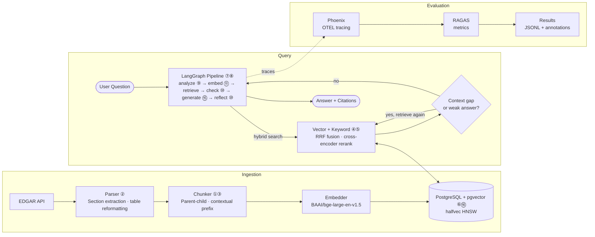

# Engineering Decisions & Tradeoffs

The technical companion to the [README](../README.md). The first half covers the *why*
behind the architecture, one decision at a time, each with its context, the choice made, the
reasoning, and what it cost, plus the alternative where there was a real one. The second half
covers how it performs, where the latency and cost actually go, what the evaluation numbers
say, and what I'd change next.

For the business-level story, see the [case study](./case-study.md).

---

## Contents

- [Design decisions](#design-decisions)
  - [Decision map](#decision-map) — the diagram, plus an index of all 16 decisions
- [Performance and evaluation](#performance-and-evaluation)
  - [Latency analysis](#latency-analysis)
  - [Cost analysis](#cost-analysis)
  - [Evaluation results](#evaluation-results)
- [What's next](#whats-next)

---

## Design decisions

### Decision map

This is the same architecture as the [README overview](../README.md#architecture-overview),
with each marker pointing to a numbered decision below, placed on the component it shaped.

**On the map**

① [parent-child chunking](#1-parent-child-chunking) ·
② [table reformatting](#2-table-reformatting-before-chunking) ·
③ [contextual chunk prefixing](#3-contextual-chunk-prefixing) ·
④ [hybrid search + RRF](#4-hybrid-search--reciprocal-rank-fusion) ·
⑤ [cross-encoder reranking](#5-cross-encoder-reranking-as-a-shortlist-re-scorer) ·
⑥ [halfvec quantization](#6-halfvec-quantization-with-float32-rescore) ·
⑦ [bounded agency](#7-bounded-agency-the-llm-plans-the-graph-controls) ·
⑧ [config-driven graph](#8-config-driven-langgraph-generation-graph) ·
⑨ [query analysis & routing](#9-query-analysis-and-routing-before-retrieval) ·
⑩ [bounded loops](#10-bounded-loops-multi-hop-and-reflection-with-dual-caps) ·
⑪ [batch embedding](#11-batch-embedding-before-fan-out) ·
⑮ [verbatim-only figures](#15-the-generator-reports-only-figures-stated-verbatim-no-arithmetic-no-substitution) ·
⑯ [idempotent ingestion](#16-idempotent-incremental-ingestion)

**System-wide** — these three sit on no single box.

⑫ [small model + structured reasoning](#12-small-model-kept-honest-by-structured-reasoning) (every LLM call) ·
⑬ [provider-agnostic LLM client](#13-provider-agnostic-llm-client) ·
⑭ [interface-driven layers](#14-interface-driven-swappable-architecture)

---

### 1. Parent-child chunking

**Context** — Small chunks retrieve precisely but starve the LLM of surrounding context.
Large chunks give the context but blur vector similarity. A single chunk size forces a
compromise between the two.

**Decision** — Two tiers. 256-token child chunks (32 overlap) are the unit that vector and
keyword search match against; 1024-token parent chunks (64 overlap) are what the LLM
actually reads. Each child links to its parent, so a precise child hit pulls in its fuller
parent for generation. Parents and children live in separate tables. Parents carry no
embedding, so keeping them apart leaves the `embedding` column and the vector index free of
null rows.

**Alternatives** — Single-tier fixed-size chunking; sentence-window retrieval.

**Why** — A small child embeds closer to the query than a large chunk would, so retrieval lands
on the right passage. The model then reads that passage's larger parent, which has the context
to answer. One size can't serve both jobs.

**Tradeoff** — Extra storage and a child→parent join on every retrieval.

---

### 2. Table reformatting before chunking

**Context** — In a financial-filings RAG the numbers *are* the answer, and many of the key
ones live in tables. The default approach, rendering each table to Markdown, breaks down on
SEC XBRL filings, whose tables are sparse and split each figure across cells, with the `$` or
`%` sign sitting in its own cell. The Markdown that falls out is mostly empty cells, pipe
characters, and stray symbols, and that structural noise dominates the chunk's embedding and
pushes it away from a natural-language query, so in practice the table holding the answer
rarely surfaced in vector search.

**Decision** — A reformatter recombines the split cells (`$` + `12,914` → `$12,914`,
`9.9` + `%` → `9.9%`), pairs each value with its column header by position, and turns each row
into a self-contained line like `Gross margin … = 72.7%`. Each table is then chunked by whole
rows, with the header line re-attached to every chunk, so no figure is split from its row or
stranded without its header. Retrieval matches at the row level, but the parent chunk is the
whole table, so the generator always sees the full table, not just the matched rows.

**Why** — Unretrievable table figures would gut a financial RAG. This is what grounds the
numeric answers, and it's why the gross-margin comparison in the README resolves at all.

**Tradeoff** — Parser complexity, and reliance on the XBRL header/label column structure
holding.

---

### 3. Contextual chunk prefixing

**Context** — A 256-token child chunk embedded on its own is context-blind. A passage stating
"gross margin … 72.7%" carries no signal about *which* company, filing, or section it came
from, so it competes poorly against same-topic chunks from other tickers and years and can be
retrieved out of context.

**Decision** — Every child chunk is embedded and indexed with a metadata prefix
(`ticker · company · form · fiscal year · section`) prepended to its text. The prefix is part
of what gets embedded and keyword-searched, not just display.

**Why** — Cheaply contextualises each chunk so retrieval can discriminate by company, year,
and section, a lightweight cousin of LLM-generated contextual retrieval, without the
per-chunk LLM cost.

**Tradeoff** — The prefix consumes tokens from the child budget; full LLM-written context
(see [what's next](#whats-next)) would add more signal at real ingestion cost.

---

### 4. Hybrid search + Reciprocal Rank Fusion

**Context** — Vector search misses exact tokens (tickers, defined accounting terms); keyword
search misses paraphrase and semantic matches. Each alone leaves a class of queries weak.

**Decision** — Run both dense vector search and PostgreSQL full-text search, then merge
the two ranked lists with Reciprocal Rank Fusion (k=60).

**Alternatives** — Vector-only; keyword-only; a weighted blend of the two raw scores.

**Why** — RRF fuses two rankers whose score scales are not comparable (cosine distance vs.
`ts_rank`) using rank position alone, so no fragile per-query normalisation is needed and
neither signal dominates.

**Tradeoff** — Two indexes to build and maintain, and because RRF discards score magnitude,
a very confident single-ranker hit gets no extra credit.

---

### 5. Cross-encoder reranking as a shortlist re-scorer

**Context** — Bi-encoder (embedding) similarity is a cheap but weak final ranking signal. A
cross-encoder is far more accurate because it attends to query and passage jointly, but it
needs a forward pass per candidate, so it cannot run over the whole corpus.

**Decision** — Fuse first, then rerank only the top-20 fused candidates down to the final 5
with `cross-encoder/ms-marco-MiniLM-L-6-v2`. Reranking is a config flag; when off, the top
`final_top_k` fused results are returned directly.

**Alternatives** — No rerank; rerank a larger candidate pool; use the LLM itself as reranker.

**Why** — Spends the expensive joint-scoring only where it changes the final answer (the
shortlist), keeping its cost bounded and predictable. An LLM reranker was the other option,
but it would trade a bounded local model for per-query API cost, latency, and non-determinism.

**Tradeoff** — Loads a model at startup and adds per-query compute.

---

### 6. halfvec quantization with float32 rescore

**Context** — Full-precision (float32) embeddings make the HNSW index large in memory, which
is the binding constraint on a modest host.

**Decision** — Store and index embeddings as `halfvec` (16-bit), oversample 40 candidates
from the quantized index, then rescore those 40 in float32 before fusion narrows to the
vector top-20. Quantization is configurable (`none` / `halfvec` / `scalar`).

**Alternatives** — Full float32 index (more memory); quantized with no rescore (cheaper, less
accurate ranking).

**Why** — Roughly halves index memory while the float32 rescore on a small candidate set
recovers the ranking accuracy quantization would otherwise cost.

**Tradeoff** — An extra rescore step. The oversampled candidates' full-precision vectors are
fetched back and re-scored in Python. Whether it earns that cost is worth an ablation; if the
halfvec ranking holds up alone on the golden set, dropping the rescore would remove the
per-query step and let the column itself be stored as halfvec, dropping the float32 copy
entirely.

---

### 7. Bounded agency: the LLM plans, the graph controls

**Context** — A common RAG pattern hands the LLM a retrieval tool and lets it decide when to
call it. That buys open-endedness but gives up control over execution. The model can forget to
retrieve and answer from memory, loop, or over-call, and no two runs take the same path.

**Decision** — Split the agency. The LLM makes the judgment calls: it plans what to retrieve
(`analyze_query`), decides whether the context gathered so far is sufficient (`check_hop`),
and critiques its own draft (`reflect`). The graph owns control flow, so which node runs next,
and how many times, is never the model's choice.

**Alternatives** — A tool-calling agent that invokes retrieval at will.

**Why** — The LLM is good at the judgment calls. Letting it also drive the sequencing (when
to retrieve, whether to loop, when to stop) is what introduces risk. Keeping control flow in
the graph gives predictable cost, traceable runs, and a known worst case without giving up
adaptive retrieval.

**Tradeoff** — The control flow is designed up front and fixed in the graph rather than worked
out by the model, so extending the pipeline to a new pattern is an explicit change.

---

### 8. Config-driven LangGraph generation graph

**Context** — HyDE expansion, multi-hop retrieval, and self-reflection each help some query
types and add latency to others. Their value is empirical, not assumed.

**Decision** — Compile the generation graph from `config/config.yaml`. Each feature is an
optional node toggled by a flag; no code change is needed to turn one on or off.

**Why** — Turns the pipeline into an experiment surface where any feature can be ablated and
measured independently against the golden set.

**Tradeoff** — Graph-assembly logic and more state to thread between optional nodes.

---

### 9. Query analysis and routing before retrieval

**Context** — Naive retrieve-then-generate runs the user's question against the index as a
single search. That wording rarely matches how a filing states things, and the exact terms a
keyword search needs may not appear in the question at all, so the right chunks often aren't
retrieved. A single search also can't split a multi-part question into one lookup per concept,
can't scope filters by ticker, year, or section, and has no way to tell when a company's
filings were never ingested.

**Decision** — An `analyze_query` node runs first: it classifies the query
(`single` / `comparison` / `out_of_scope`), resolves company names to tickers, extracts
metadata filters (ticker, fiscal year, 10-K section), and decomposes the question into one
retrieval task per concept, each carrying its own keyword query for full-text search and
semantic query for vector search and reranking. Any query that yields more than one task (a
comparison across companies or years, or a single company with several distinct concepts) fans
out into parallel tasks via LangGraph's `Send`.

**Why** — Enables better-targeted retrieval, metadata-scoped filtering, true multi-entity
comparison, and honest refusal of out-of-scope questions instead of answers guessed from memory.

**Tradeoff** — An extra upfront LLM call, and the largest one in the pipeline. Routing
mistakes also propagate downstream.

**Recovering from an over-narrow section filter** — A section filter sharpens precision but
can backfire, because companies vary in which 10-K item holds a given figure (financial-statement
detail sometimes sits under Item 15/16, not Item 8), so a confident-but-wrong section pin can
exclude the answer entirely. The retriever guards against this. When a section-filtered
search returns nothing, or its top reranked result falls below a configurable relevance floor,
it re-runs without the section filter (ticker and
fiscal year kept) and merges both sets, letting the reranker arbitrate. Because the merge
takes the top-k by reranker score over the union, widening can only add a better candidate,
never displace a strong section-filtered hit. The floor is a reranker-score concept, so the
retry requires reranking to be enabled.

---

### 10. Bounded loops: multi-hop and reflection with dual caps

**Context** — Iterative retrieval (look again if context is thin) and self-reflection (retry
if the answer is weak) both improve quality but can loop indefinitely or interact badly.

**Decision** — `check_hop` may plan a follow-up retrieval when context is insufficient, and
`reflect` may trigger re-retrieval when answer quality is low. Both are bounded by explicit
caps (`max_hops`, `max_iterations`), and a routing flag makes a reflection
re-retrieval bypass `check_hop` so the two loops can't compound. Either loop also excludes
the context it already holds, so a second pass has to surface something new rather than
re-fetching what the first pass already returned.

**Alternatives** — A single combined loop.

**Why** — Caps guarantee termination and a bounded worst-case cost; the routing flag keeps
the two loops from feeding each other.

**Tradeoff** — Caps can stop one hop short of a better answer on genuinely hard queries.

---

### 11. Batch embedding before fan-out

**Context** — Queries that fan out into several retrieval tasks were slower than the work
warranted. Profiling pointed at embedding. The graph fans out `retrieve` workers as threads,
and because model inference is CPU-bound, the GIL **serialised** the N per-task embed calls
(≈ N × embed-time) instead of parallelising them, so latency grew with the number of tasks.

**Decision** — A dedicated `embed_queries` node collects every pending task query and embeds
them in a single batched forward pass before the fan-out.

**Alternatives** — Multiprocessing the per-task embed calls to bypass the GIL.

**Why** — One batched pass over an [N × dim] matrix uses hardware (BLAS/SIMD) parallelism
instead of Python threads, so embedding time stays nearly flat across the tasks a query
produces, rather than scaling linearly. For fan-out queries it cuts latency with no quality
tradeoff. Multiprocessing would also bypass the GIL, but it only helps with spare cores a
small host doesn't have, whereas batching speeds up even on a single core. The same batched
pass is also what a GPU parallelizes best, if one is ever added.

**Tradeoff** — A dedicated node plus the state plumbing to carry embeddings to the workers.

---

### 12. Small model, kept honest by structured reasoning

**Context** — Running a small model (`gpt-4o-mini`) keeps cost low, but a small model is
likelier to slip on exactly the errors that matter in a filing, like attributing a figure to
the wrong entity or stating a number the source never gives.

**Decision** — Keep the small model, but force it to show its work. Every reasoning node prompt
makes the model fill a structured `reasoning` field and work through fixed, named steps
*before* it writes the answer. The steps are constrained, not free-form chain-of-thought. The
answer is written at the generate node, so that is where the grounding steps concentrate. One,
for instance, is an entity-scope check that confirms a figure is attributed to the exact entity
the query asks about before it's cited. Another is a derivation check that flags any figure
needing arithmetic and marks it unavailable rather than computing it. Each figure is also
mapped to a citation index, and a later reflect pass re-checks the answer's figures against the
sources.

**Alternatives** — A larger model answering directly, or free-form chain-of-thought without
typed, ordered steps.

**Why** — Because the steps are fixed rather than free-form, working through them is itself the
grounding check, not just the model thinking out loud. The entity-scope check is what stops a
consolidated figure being reported as a segment's (without it, a $60.9B company-wide total was
mislabelled exactly that way), and the derivation check stops the model presenting a number it
can only infer rather than quote. Forcing the small model to reason explicitly also recovers
much of the accuracy a bigger model would give, at a fraction of the cost. Faithfulness comes
from the scaffold, not from trusting the model to behave.

**Tradeoff** — The reasoning adds output tokens, which is itself the dominant latency cost
(see [Latency analysis](#latency-analysis)). The small model can still slip on the hardest
cases.

---

### 13. Provider-agnostic LLM client

**Context** — Cloud APIs are convenient but cost per token and send filing data off-host.
Local models keep the data on the machine and have no per-token fee, but the ones that fit
on a modest host are weaker.

**Decision** — A single `BaseLLM` interface over an OpenAI-compatible provider and Ollama,
selected by config, with base URL and key in `.env`. Every call returns its token counts.
The per-answer cost shown in the UI and the [cost analysis](#cost-analysis) below are both
computed from those counts.

**Alternatives** — Hardwire one provider. Or skip the home-grown interface and use a
multi-provider library or gateway like LiteLLM.

**Why** — Running the same pipeline fully cloud or fully local was a requirement (cost
control, and keeping filing data on-host), which rules out hardwiring. A gateway would also
do it, but this project needs two providers and two call types, which is small enough to own
outright, and owning the interface means tracing is instrumented once in the base class
rather than per provider. A gateway is also a running service. This demo deploys on free
tiers, a Hugging Face Space and serverless Postgres, with no other infrastructure to
operate, and standing up a service just to switch between two providers wasn't worth it.
Nothing is foreclosed either way. The base URL is configurable, so the OpenAI-compatible
provider can point at a vLLM server or a LiteLLM gateway later without any pipeline change.

**Tradeoff** — The interface only exposes what both providers support. Provider-specific
knobs (OpenAI's `logit_bias`, Ollama's context-length and keep-alive options) stay out until
the interface is widened, and each widening has to make sense for both backends. Rolling our
own also means none of the operational features a gateway bundles, like rate limiting,
failover, or spend caps. This deployment needs none of those, and if one ever does, the
configurable base URL is the migration path.

---

### 14. Interface-driven, swappable architecture

**Context** — Almost every component is a candidate for replacement: PostgreSQL might become a
managed vector DB, FTS might become BM25, the embedder or reranker might change, the LLM
provider varies by deployment.

**Decision** — Every layer sits behind an abstract base class: downloader, parser, chunker,
embedder, vector store, keyword and vector retrievers, reranker, fusion, LLM, the
repositories and DB client, and the evaluation extractors/evaluators/exporters. Concrete
implementations are chosen by config, and callers depend only on the interface.

**Why** — Any component can be swapped, or a second implementation added, without touching the
rest of the pipeline. The provider-agnostic LLM client above is one instance of this
principle. Swapping FTS for BM25, or PostgreSQL for a managed vector DB, would follow the
same route: a new class implementing the existing interface, and a config change to select it.

**Tradeoff** — More indirection and boilerplate than wiring concrete classes directly.

---

### 15. The generator reports only figures stated verbatim: no arithmetic, no substitution

**Context** — LLMs will confidently compute derived metrics (gross margin %, ratios, growth)
from extracted figures, and get them wrong often enough to be dangerous in a financial
context.

**Decision** — The generation prompt forbids arithmetic, and more broadly forbids reporting
any figure that isn't stated verbatim under its own label. Each figure must be quoted
word-for-word from a retrieved chunk, must be attributed to the right entity (a consolidated
total is never reported as a segment's), and must not be summed into a total the source never
states. Anything that fails these checks comes back as "not stated in the filing". A related
failure, answering with a lookalike figure (gross property, plant and equipment (PP&E), or
depreciation, when capital expenditures was asked), is caught here by a rule that rejects any
figure whose label names a different metric, even when it shares a word. Query analysis
guards the same failure earlier in the pipeline, building its search queries from the line
items that actually report the requested metric, so a free-cash-flow question searches for
the cash flow statement's "operating activities" and "capital expenditures" lines rather than
the phrase "free cash flow", and the hop check treats a retrieved table whose label doesn't
match the question as missing data and retrieves again.

**Alternatives** — Let the model compute, or add a calculator/code tool for numerics.

**Why** — LLMs do arithmetic unreliably, and a miscalculation reads exactly like a correct
result. In a financial context a confidently wrong number is far worse than an honest "not
stated", so the system optimises for faithfulness over coverage. Refusing the arithmetic
drops less information than it might seem. When a question needs a derived metric, query
analysis decomposes it into its components (gross margin % becomes revenue and cost of
revenue, retrieved as separate tasks) and the answer reports each component verbatim, so the
reader gets every input for the calculation, and only the calculated metric itself is
withheld. If derived metrics ever become a requirement, the right addition is a calculator or
code tool, where the model supplies the verbatim inputs and deterministic code does the math.

**Tradeoff** — Some legitimately answerable (by arithmetic) questions return "not stated",
even though the answer is one division away.

---

### 16. Idempotent, incremental ingestion

**Context** — Ingestion gets re-run constantly, after adding a ticker, fixing a parser, or a
crash mid-run. A re-run must never duplicate rows or leave the database half-written.

**Decision** — The SEC accession number is the dedup key. As soon as the downloader resolves
a filing, the pipeline checks it against the database and skips anything already fully
ingested, before any parsing, chunking, or embedding happens. The filing row, parent chunks,
and child-chunk metadata are inserted in a single transaction, so a crash rolls the whole
filing back rather than leaving partial rows. Embedding writes happen after that transaction
commits, one upsert per chunk. A chunk that is missing its embedding is just a row with a
null embedding column, so the next run detects those rows on its own and completes the
filing by writing only what is missing. A filing orphaned by an earlier crash is detected
and re-ingested. The same accession number is carried on every citation, pinning each answer
to the exact filing it came from.

**Alternatives** — Wipe and re-ingest from scratch on every run, or track ingestion progress
in a separate jobs table.

**Why** — Filings are immutable once filed, so the accession number identifies the content
and skipping a filing that is already present is safe. Wiping and re-ingesting would also be
correct, but it throws away all the embedding work already done just to add one ticker. A
jobs table is the standard answer at bigger scale, but here it would be a second copy of the
truth that can drift from the data it describes. Instead, progress is read from the data
itself. A filing row means the metadata landed, and a chunk without an embedding still needs
one, so after a crash the next run knows exactly what is left. The transaction boundary
follows the same logic. Metadata inserts are cheap to redo, so they are all-or-nothing.
Embeddings are the expensive output, so each is committed as written and a crash loses only
the one in flight.

**Tradeoff** — The skip needs the accession number, which only exists after the EDGAR fetch,
so a re-run still downloads each filing before deciding. And the skip fires on the accession
number alone, so after a parser or chunker fix, re-ingesting a filing means deleting its
rows first.

---

## Performance and evaluation

### Latency analysis

Numbers are p50 wall times from Phoenix traces of evaluation runs with `gpt-4o-mini`,
reranking on, multi-hop capped at one and reflection off. The runs share a loaded host, so
treat absolutes as upper bounds and the relative shares as the signal. An answered query
takes about 25s at p50 and 38s at p90. Out-of-scope queries stop after `analyze_query` and
return in about 3s.

**`analyze_query` — 7.1s, the largest node.** One LLM call that plans all retrieval. The
time is almost entirely its own output, ~380 tokens of structured reasoning and task plan,
the most of any node. The fix is trimming that output, gated on an eval showing grounding
holds (see [what's next](#whats-next)).

**`embed_queries` — 0.7s.** One batched forward pass over all task queries on the local
embedding model, roughly flat in the number of tasks (decision #11). Hardware-bound, so a
GPU would shrink it, but at ~3% of the pipeline it isn't the place to spend.

**`retrieve` — 4.9s per task, ~3 tasks in parallel.** No LLM call. The time is network
round trips to serverless Postgres (~75ms each), not compute — the FTS query itself
executes in ~1ms server-side. Most of the known waste is two round-trip amplifiers: a
liveness ping on every connection checkout, and a second full query fired when a keyword
search's AND-match comes up empty. Removing those and running the vector and keyword legs
in parallel are the identified fixes. The reranker is deliberately not on this list. An
early benchmark said it scaled badly under concurrency, but repeated measurement (min over
8 trials) showed shortlist reranking is cheap, and the first result was a transient load
spike. No single-run microbenchmark on a shared host is trusted here since.

**`check_hop` — 3.8s.** One LLM call per hop deciding whether the retrieved context
suffices. Its ~160 output tokens are mostly the structured reasoning the decision is
required to show (decision #12). Whether its follow-up retrievals improve answers enough to
justify the call is unmeasured, which is what the A/B in what's-next is for.

**`generate` — 4.3s.** The LLM call that writes the answer, ~250 output tokens covering its
reasoning steps and the answer itself. It carries the retrieved context, the largest input
in the pipeline at ~5,000 tokens, but input barely moves latency. Output does.

**`hyde_expand` and `reflect` — optional, and off in these runs.** Each adds an LLM call when
enabled, with reflect measured separately at ~4.1s plus a regeneration when it triggers a
retry.

**The LLM calls are the floor.** The three sequential calls come to ~15s of the 25s p50 and
cannot overlap, so no retrieval fix reaches them. Per call, latency is a fixed overhead plus
output tokens at a measured ~54 tokens/second. Since every node's output carries the
reasoning scaffold from decision #12, trimming has a floor. That leaves three levers.

- Trim output tokens. Latency tracks output, so every LLM node is a candidate, and
  `analyze_query` has the most to cut at ~380 reasoning tokens. Any trim has to pass the
  grounding eval first.
- Cut a call. `check_hop` goes if the A/B shows its follow-up hops don't earn their cost.
- Swap the model. Smaller models like `gpt-4.1-nano` stream faster and cost less, but they
  put at risk the structured-output accuracy this pipeline leans on. Haiku-class models are
  fast but cost roughly seven times more per token than `gpt-4o-mini`. Any swap is gated on
  the golden-set eval before its latency counts.

---

### Cost analysis

A query's cost is capped before it runs. The pipeline lets the model decide whether it needs
another round of retrieval, but the graph, not the model, controls how many times it can ask
(decision #7). Every loop has a config limit on how many LLM calls it can make, so the
per-query call count, and the cost that follows, has a known ceiling for any configuration.
Without that limit a model that keeps deciding it needs more context could loop indefinitely,
which can raise costs significantly in a production system.

The only operating cost is LLM API spend. Embedding and reranking run on self-hosted models
with no per-query fee. The per-query costs below come from the same evaluation runs as the
latency analysis, with HyDE off, multi-hop capped at one hop and reflection off. Each token
count is the usage the API reported for a call, captured in its Phoenix span and summed per
query, so the numbers are measured rather than estimated. Pricing:
`gpt-4o-mini` at $0.15/M input, $0.60/M output (July 2026).

With this configuration an answered query makes three LLM calls (`analyze_query` →
`check_hop` → `generate`). A query the router classifies as out of scope stops after the first
call, because `analyze_query` returns no retrieval tasks. Each optional feature adds calls on
top: HyDE adds one expansion call per retrieval task, every additional hop adds a `check_hop`
call, and a reflection pass adds a `reflect` call, plus a regeneration when it asks for one.

| Query type | Input tokens (mean) | Output tokens (mean) | Cost/query |
|---|---|---|---|
| Single | 12,035 | 662 | ~$0.0022 |
| Comparison | 15,159 | 940 | ~$0.0028 |
| Out-of-scope | 3,449 | 183 | ~$0.0006 |

That works out to roughly $2 to $3 per thousand queries, and a full evaluation run over the
golden set costs about $0.20. Each answer in the UI shows its own token usage and estimated
cost, so a user sees the price of the query they just ran.

Two things keep cost flat as the corpus grows. Building the index makes no model API calls at
all, since embedding runs on a self-hosted model, so ingesting more filings costs machine time
rather than dollars per token. A query's cost doesn't rise with corpus size either, because
the model only ever sees the top few retrieved chunks and never the whole corpus. Whether the
index holds thirteen filings or thirteen thousand, the number of input tokens going into
`generate` stays similar. What grows with scale is the infrastructure tier, the app host and
the database. The demo runs on free tiers today (a Hugging Face Space and serverless
Postgres). That's a deliberate choice because the traffic doesn't need more. Scaling up a tier
is a config change, and switching to different infrastructure altogether stays contained
because each layer sits behind an interface (decision #14).

The bottlenecks differ from the ones in the latency analysis. `analyze_query` dominates
*latency* because it emits the most output tokens and latency tracks output, while `generate`
dominates *cost* because it carries the retrieved context, the largest input in the pipeline.
Model choice also moves cost more than any other lever here. The table below shows the
estimated cost per model, holding the measured single-query token counts constant:

| Model | Price ($/M in, out) | Cost/query | vs. baseline |
|---|---|---|---|
| OpenAI `gpt-4o-mini` (default) | 0.15 / 0.60 | ~$0.0022 | 1× |
| Anthropic Claude Haiku 4.5 | 1.00 / 5.00 | ~$0.015 | ~7× |
| OpenAI `gpt-4o` | 2.50 / 10.00 | ~$0.037 | ~17× |

A different model tokenizes the input slightly differently and emits a different amount of
output, so read these as estimates rather than separate measured runs. The gap is driven almost entirely by input
price, since the retrieved context dwarfs the answer. Swapping between them is a config change
(decision #13), and decision #12 covers why the small model holds up here.

---

### Evaluation results

The numbers below come from a golden-set run scored with RAGAS. The pipeline ran in the same
configuration as the latency and cost sections, with HyDE off, multi-hop capped at one hop
and reflection off. The full table is in the
[README](../README.md#results).

Retrieval used to be the weak point here. Widening an over-narrow section filter (decision #9)
is what fixed it, and coverage on comparisons went from roughly 72% to 94%. Context recall now
sits at 0.97 on single-company questions and 0.94 on comparisons, so whatever the reference
answer needs is almost always somewhere in the passages the model gets. Scope handling held up
as well. The system declined 16 of 17 out-of-scope questions and wrongly refused one that was
in scope.

Answer quality slips on comparisons. Single-company questions score 0.90 on faithfulness and
0.85 on correctness. Multi-entity questions score 0.85 and 0.70 through the same pipeline.
Recall hardly moves between them, so nothing is being lost in retrieval. What changes is the
load on the model. Every entity in a comparison adds another retrieval leg, so the context
grows and fills up with near-identical figures drawn from different filings. That is where a
small model has the most room to pick wrong.

Two different things sit behind those faithfulness scores. The score can't tell them apart, so
I read the lowest-scoring traces.

The first is a real hallucination. In one comparison answer the model reported a net income
figure that no retrieved passage contains, cited an excerpt for it, and passed its own
verbatim check on the way through (decision #15). A check the model runs on itself is not a
control, so a firmer instruction in the prompt won't fix this. The fix is a deterministic
guardrail that pulls every figure out of the finished answer and requires each one to appear
in a cited passage, which needs no cooperation from the model.

The second isn't really a failure. An effective tax rate that was correct and properly sourced
scored zero on faithfulness. Knowing how the score is built explains why. One LLM breaks the
answer into separate factual claims. A second decides which of those claims the retrieved
context supports. The score is the proportion that survive, so ten claims with one rejected
gives 0.9. That second pass is where financial figures trip it up, because $4.9B and $4,899M
can read as a mismatch. The number came out lower than the system deserved.

Context precision is the softest metric, 0.73 on single-company questions and 0.62 on
comparisons, and it's the one I'd tune next. Some of that is bought on purpose. The widening
above pulls in extra passages whenever a section filter looks wrong, and precision is what it
pays with. The rest is the reranker. It's the general-purpose MiniLM cross-encoder from
decision #5, and it has no idea that a figure inside a financial statement table should
outrank the same figure mentioned in passing prose. Trimming the final top-k would help. So
would tuning the widening threshold. The more durable fix is a reranker that understands
financial text, either a small cross-encoder fine-tuned on the golden set or a finance-tuned
one off the shelf.

**Limits of this evaluation.** The golden set was generated by an LLM from the filings and is
only partially reviewed, so a wrong reference answer feeds straight into the correctness and
recall numbers above. The answering model and the judge are both `gpt-4o-mini`. That means the
grader is no stronger than the thing it grades, and the tax-rate case shows it marking down
figures the pipeline got right. Before leaning on these scores any harder I'd validate the
grader on a hand-checked subset and tune or swap the metrics that misread numbers. Scores also
drift between runs, because the grading is itself an LLM call. And the questions were written
from the same filings the system searches, so they are probably easier than what a real user
would ask. All of this makes the numbers a directional read. It's also why a fully hand-reviewed
golden set and an independent judge lead the next section.

---

## What's next

Ordered by what I'd do first. The evaluation work leads, because every fix after it gets
judged by those numbers.

- **A larger, fully hand-reviewed golden set.** The current one is LLM-generated and only
  partially reviewed, so a wrong reference answer quietly becomes a wrong score.
- **An independent judge.** Score with a stronger model than the one being graded, and
  validate it on a hand-checked subset before tuning anything against these metrics.
- **Component-level evaluation.** Score retrieval on its own against known-good chunks, with
  deterministic metrics like recall@k and MRR that don't drift between runs the way the
  LLM-graded scores above do. Most of the work is labelling which chunks count as correct for
  each query, and that's the same pass as hand-reviewing the golden set.
- **A deterministic grounding guardrail.** Pull every figure out of a finished answer and
  require it to appear in a cited passage, flagging the answer when it doesn't. This catches
  the hallucination above without relying on the model to police itself.
- **Trim `analyze_query` output tokens.** It emits the most output of any node and output is
  what drives latency, so it's the largest single saving available. Gated on an eval
  confirming grounding still holds.
- **A/B `check_hop` on and off** on the golden set. It asks for a follow-up retrieval on about
  40% of calls, far more often on comparisons than on single-company questions. Whether those
  extra hops improve the answer enough to justify another LLM call is unmeasured.
- **A reranker that understands financial text**, either a small cross-encoder fine-tuned on
  the golden set or a finance-tuned one off the shelf. The current MiniLM has no notion that a
  figure in a statement table outranks the same figure in prose, which is where precision is
  leaking.
- **Ablation numbers** for vector-only against hybrid, and reranking on against off. Decisions
  #4 and #5 both argue for the current setup, but neither is measured against the alternative
  on this corpus.
- **Full LLM-generated contextual retrieval**, with per-chunk context written by an LLM at
  ingestion instead of the current metadata prefix (decision #3). More retrieval signal, paid
  for in ingestion cost.
