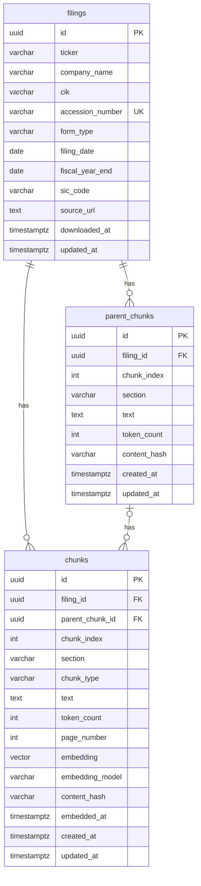

# Database Schema

Three tables store all filing data, chunked text, and vector embeddings.  
The DDL template lives in [`db/schema.template.sql`](../db/schema.template.sql) — run via `python db/setup.py`.

---

## Entity Relationship Diagram

---

## Table: `filings`

One row per SEC filing document. Supports any form type (10-K, 10-Q, 8-K, …).

| Column | Type | Description |
|---|---|---|
| `id` | UUID | Primary key, system-generated |
| `ticker` | VARCHAR | Stock ticker symbol, e.g. `NVDA` |
| `company_name` | VARCHAR | Full legal company name |
| `cik` | VARCHAR | EDGAR Central Index Key — unique identifier assigned by the SEC to each filer |
| `accession_number` | VARCHAR | EDGAR canonical filing ID, e.g. `0001045810-23-000017`. Unique across all filings. Used to construct direct EDGAR URLs for citations — format: `https://www.sec.gov/Archives/edgar/data/{cik}/{accession_no_dashes}/{filename}`. |
| `form_type` | VARCHAR | Filing type: `10-K`, `10-Q`, `8-K`, etc. |
| `filing_date` | DATE | Date the filing was submitted to the SEC |
| `fiscal_year_end` | DATE | End date of the fiscal year covered by this filing |
| `sic_code` | VARCHAR | Standard Industrial Classification code — enables sector-based filtering |
| `source_url` | TEXT | Full EDGAR URL to the filing document |
| `downloaded_at` | TIMESTAMPTZ | When the raw filing was fetched from EDGAR |
| `updated_at` | TIMESTAMPTZ | Set by the application when filing metadata is corrected. Null on initial ingestion. |

---

## Table: `parent_chunks`

One row per large context chunk (~1024 tokens). Parent chunks are **not embedded** — they are retrieved after a matching child chunk is found, to provide richer context to the LLM.

| Column | Type | Description |
|---|---|---|
| `id` | UUID | Primary key, system-generated |
| `filing_id` | UUID | Foreign key → `filings.id` |
| `chunk_index` | INT | Sequential position of this chunk within the filing (0-based). Unique per filing. |
| `section` | VARCHAR | 10-K section this chunk belongs to, e.g. `Item 1A Risk Factors`, `Item 7 MD&A` |
| `text` | TEXT | Full text of the parent chunk |
| `token_count` | INT | Token count of `text` — used at query time to verify the chunk fits in the LLM context window |
| `content_hash` | VARCHAR | SHA-256 of `text`. On re-ingestion, unchanged chunks are skipped; changed chunks trigger re-processing of their children. |
| `created_at` | TIMESTAMPTZ | Row creation time |
| `updated_at` | TIMESTAMPTZ | Auto-set by trigger when the row is updated. Null on initial ingestion. |

---

## Table: `chunks`

One row per small retrieval chunk (~256 tokens). These are the units that get embedded and searched via vector similarity. Each chunk optionally links to a `parent_chunk` for context expansion at query time.

| Column | Type | Description |
|---|---|---|
| `id` | UUID | Primary key. Also serves as the provenance/citation key — uniquely identifies the source of any generated answer. |
| `filing_id` | UUID | Foreign key → `filings.id` |
| `parent_chunk_id` | UUID | Foreign key → `parent_chunks.id`. Nullable — a chunk with no parent is treated as standalone. |
| `chunk_index` | INT | Sequential position of this chunk within the filing (0-based). Unique per filing. **Filing-scoped, not parent-scoped** — adjacent-chunk retrieval must filter by `parent_chunk_id`, not by `chunk_index ± 1` alone. |
| `section` | VARCHAR | 10-K section this chunk belongs to, e.g. `Item 1A Risk Factors` |
| `chunk_type` | VARCHAR | Content type: `narrative`, `table`, or `list`. Enables type-specific retrieval strategies. |
| `text` | TEXT | Text of this chunk |
| `token_count` | INT | Token count of `text` |
| `page_number` | INT | Source page number in the original filing. Used for citations. Nullable when not available. |
| `embedding` | VECTOR | Dense vector representation of `text`. Dimension is set by `config.embedding.dimension` (default: 1024). |
| `embedding_model` | VARCHAR | Model used to generate the embedding, e.g. `BAAI/bge-large-en-v1.5`. Needed to identify chunks that require re-embedding after a model change. |
| `content_hash` | VARCHAR | SHA-256 of `text`. Prevents re-embedding a chunk whose text has not changed. |
| `embedded_at` | TIMESTAMPTZ | When the embedding was last generated. Null until the chunk has been embedded. |
| `created_at` | TIMESTAMPTZ | Row creation time |
| `updated_at` | TIMESTAMPTZ | Auto-set by trigger when the row is updated. Null on initial ingestion. |

---

## Key Design Decisions

**Why separate `parent_chunks` and `chunks` tables?**  
Parent chunks serve a different purpose (context delivery) than child chunks (vector retrieval). Parent chunks carry no embedding, so merging them into one table would leave the `embedding` column null for half the rows and pollute the vector index.

**Why is `embedding` dimension configurable?**  
pgvector requires a fixed dimension at table creation time. The dimension is read from `config.embedding.dimension` by the setup script and injected into the DDL — never hardcoded in application code. Changing the model requires a migration and full re-embedding.

**Why `content_hash` on chunks?**  
SEC filings are immutable once filed. The hash guards against accidental duplicate ingestion of the same filing, and allows the ingestion pipeline to skip re-embedding chunks whose text has not changed.

**Why `accession_number` for citations instead of joining on `id`?**  
The accession number is the SEC's canonical, human-readable identifier for a filing. It can be used to construct a direct EDGAR URL without any joins. The join to `filings` is still available for richer citation metadata (ticker, fiscal year, etc.).
